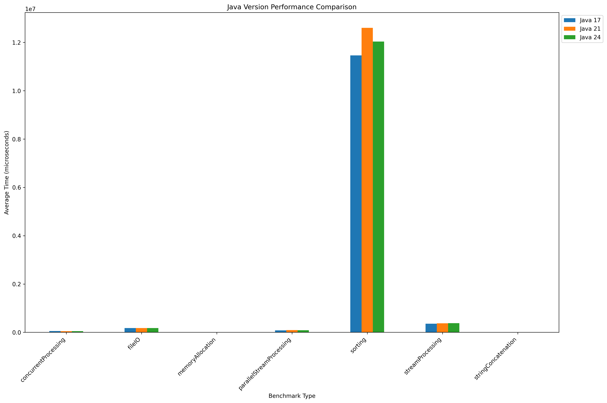

# Java Performance Benchmarks

This project contains aims to benchmark and compare Java 8, Java 17, Java 21, and Java 24. The benchmarks cover common programming scenarios including stream processing, string operations, file I/O, concurrent processing, and memory operations.

## Benchmarks Included

- **Stream Processing**: Measures performance of sequential stream operations
- **Parallel Stream Processing**: Tests parallel stream performance
- **String Concatenation**: Evaluates string concatenation efficiency
- **Sorting**: Measures collection sorting performance
- **File I/O**: Tests file read/write operations
- **Concurrent Processing**: Evaluates multi-threaded computation
- **Memory Allocation**: Measures memory allocation performance

## Prerequisites

- Sdkman with Java 8, Java 17, Java 21, and Java 24 (maybe you could change the path of your skd man in `run_benchmarks.py`)
- Maven

The results will be saved in `benchmark-results.json` in the project root directory.

## Benchmark Configuration

The benchmarks are configured with the following parameters:

- Warmup: 2 iterations
- Measurement: 3 iterations
- Fork: 1
- JVM args: -Xms1g -Xmx1g
- Time Unit: Microseconds
- Benchmark Mode: Average Time

## Understanding the Results

The benchmark results are output in JSON format and include:
- Average execution time for each operation
- Standard deviation
- Sample size
- Score error

## Latest Benchmark Results

The graph above shows the performance comparison between Java 17, Java 21, and Java 24 across different benchmark types. Key observations:
- Sorting operations show the highest time consumption across all versions
- Java 21 shows slightly higher sorting times compared to Java 17 and Java 24
- Stream processing, concurrent processing, and other operations show relatively similar performance across versions
